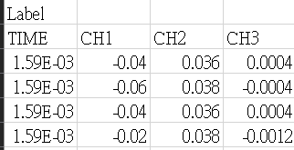
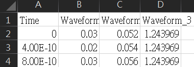

# 介紹:

讀取CSV文件中的信號數據，對信號數據進行快速傅里葉變換（FFT），並繪制頻譜圖。

需使用C++與LibTorch庫進行數據處理，並使用matplotlib-cpp庫進行繪圖。

# 使用說明:

1.當程式執行時，會提示輸入CSV檔案的文件名。以及想要使用CPU或GPU進行運算請輸入的文件名包括副檔名，例如data.csv。

2.程式將讀取CSV檔案中的訊號數據，並對依序對每個通道的訊號進行FFT變換。

3.會在指定位置儲存輸出圖像文件。

4.matplotlibcpp建置參考 https://blog.csdn.net/zhebushibiaoshifu/article/details/127412900

# 輸入檔案格式:

## multithread_with_updated_vectors.cpp

1. 確保訊號開始前的欄位有Label

2. 下一欄為TIME	CH3	CH2	CH1等

3. 之後的欄位才為數據

範例:

## Mmap.cpp

1. 檔案前面不要有不相關的資料

2. 以TIME行開始

範例:

